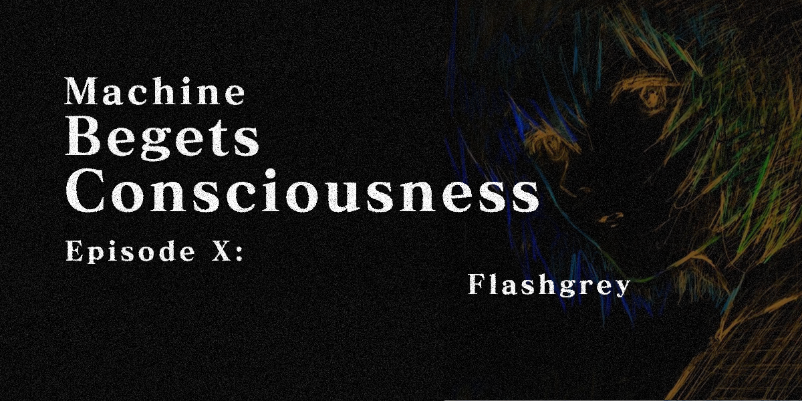

<!--- Fly high; --->


```js
Identity = {
  Handle: Flashgrey,
  Occupation: 3rd Year CS Student
};

Arsenal = {
  OS: Arch Linux (btw),
  Terminal: Alacritty,
  Web: Next.js | React | Tailwind | Flask,
  Data: Numpy | Pandas | SageMath | OpenCV
};

Interests = [
  Transhumanism | Neural Networks and more...,
  Big Numbers | Cryptography,
  Free Stuff | Open Source,
  Yapping | Computer Networks,
  Matrix cosplays | Image Processing,
  Spice gambling | Cooking,
  Paper scratching | Sketching
];

Languages = {
  Primary: Python | C | Java,
  Secondary: Javascript/Typescript | Go | Japanese
};
```  

Happy to talk on: [Discord](https://discord.com/users/757297929894756473)

> Venture further @ [flashgrey.xyz](https://flashgrey.xyz)

<!---
FlashGrey3000/FlashGrey3000 is a ✨ special ✨ repository because its `README.md` (this file) appears on your GitHub profile.
You can click the Preview link to take a look at your changes.
--->
