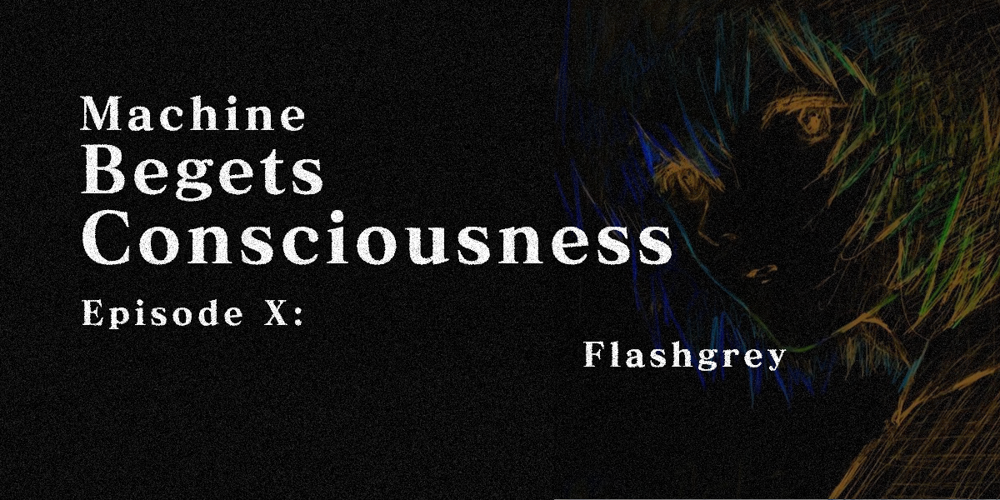

<!--- Fly high; --->


```js
Identity = {
  Handle: Flashgrey,
  Occupation: 3rd Year CS Student
};

Arsenal = {
  OS: Arch Linux (btw),
  Terminal: Kitty,
  Army: 2 cats
};

Interests = [
  Transhumanism | Neural Networks,
  Big Numbers | Cryptography,
  Free Stuff | Open Source,
  Yapping | Computer Networks,
  Matrix Cosplays | Image Processing,
  Spice Gambling | Cooking,
  Wasting Lead | Sketching
];

Languages = {
  Primary: Python | C | Java,
  Secondary: Javascript/Typescript | Go | Japanese,
  Preference: Systems
};

Status = {
  Learning: System Design,
  Building: Things I want to understand,
  Currently: Software testing | Vector DBs | Tool Calling
};

Projects = {
  NNinC: A Neural Network implementation in C,
  Autos: Automata game theory simulations,
  Uminibin: Anonymous one-time messaging site,
  Frame Forge: A basic video editing app,
  Book Trade Hub: Book trading site
};
```  

Happy to talk on: [Discord](https://discord.com/users/757297929894756473)

> Venture further @ [flashgrey.dev](https://flashgrey.dev)

<!---
FlashGrey3000/FlashGrey3000 is a ✨ special ✨ repository because its `README.md` (this file) appears on your GitHub profile.
You can click the Preview link to take a look at your changes.
--->
